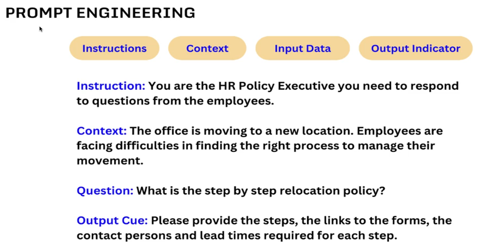
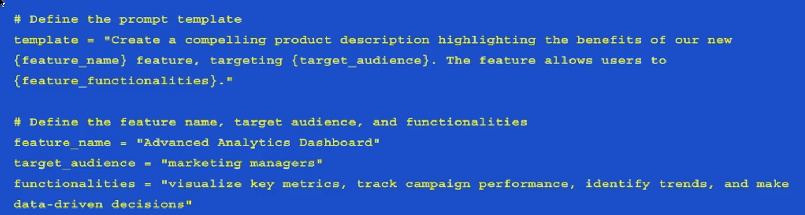
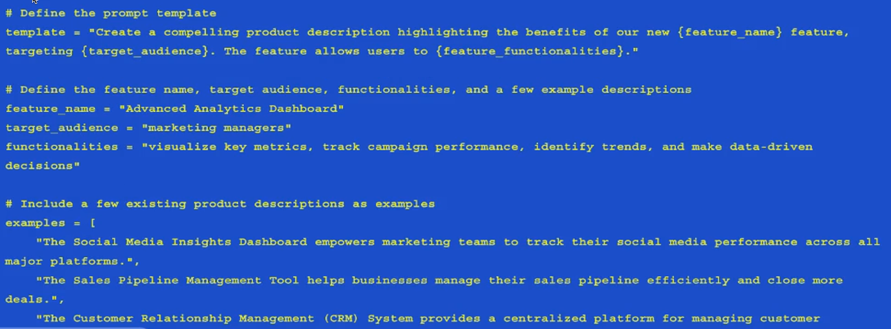
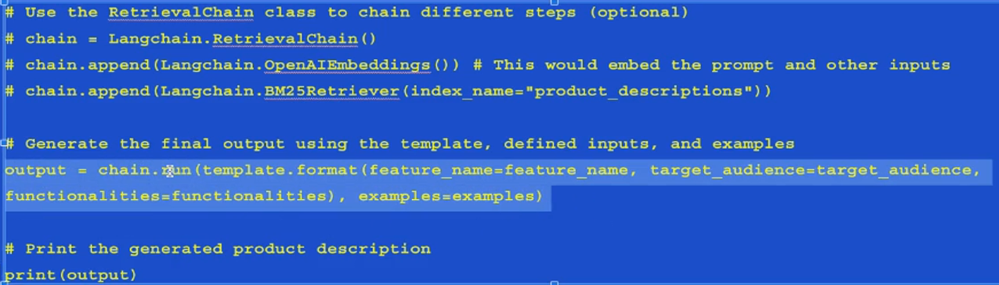
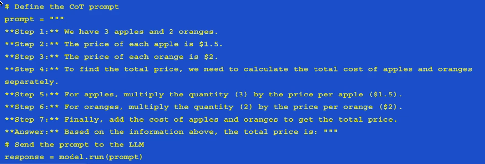

# Introduction to Prompts

Prompt engineering is integral.

## Components of a Prompt

* Instructions - tell the model what to do, how to use external information if provided, what to do with the query, and 
how to construct the output.
* External Information - or context(s) act as an additional source of knowledge  for the model. These can be manually 
inserted into the prompt, retrieved via a vector database, or pulled in via other means (APIs, calculations, etc).
* User Input or query - typically (but not always) a query input into the system by a human user.
* Output Indicator - marks the beginning of the to-be-generated text.  If generating Python code, we may use import to 
indicate to the model that it must begin writing Python code (as most Python scripts begin with import).

## Prompt Templates

Prompt templates are predefined "recipes" for generating prompts for language models.
* A template may include instructions, few-shot examples, and specific context and questions appropriate for a given task.
* LanChain provides tooling to create and work with prompt templates
* LanChain strives to create model agnostic templates to make it easy to reuse existing templates across differing LLMs.
* Typically, language models expect the prompt to either be a string or else a list of chat messages.

## Zero Shot Prompt
Direct prompting (known as Zero-shot) is the simplest type of prompt. It provides no examples to the model, just instructions. 
You can also  phrase the instruction as a question, or give the model a "role".

## Few Shot Prompt

Few shot prompts provide one or more examples, known as "shots", we can condition the model to generate desired outputs.

Examples provide a format and general guide for the generated content. Then the example below shows how we will use LangChain 
RetrievalChain class to chain the different steps together to submit to the LLM for output generation.

## Chain of Thought Prompting

In LangChain, chain of thought prompting is a technique used to guide an LLM through a series of logical steps towards
completing a complex task. The Chain of Thought is the specific steps the LLM should follow in order to arrive at the 
desired output. 

## Tokens

In LLMs, the term "token" refers to a chunk of text that the model reads or generates.

A token is generally not a word; it could be a smaller unit, like a character or a part of a word, or a larger one like 
an entire phrase. 

## Context Window

For an LLM, the context window is the max amount of text the model can consider at any one time when generating a response. 

This includes the prompt  AND the generated text. Essentially, this is short term memory. Too short of a context window and 
the model can "forget" or lose the first part of the prompt and impact the model's consistency in long conversations or 
complex tasks.

