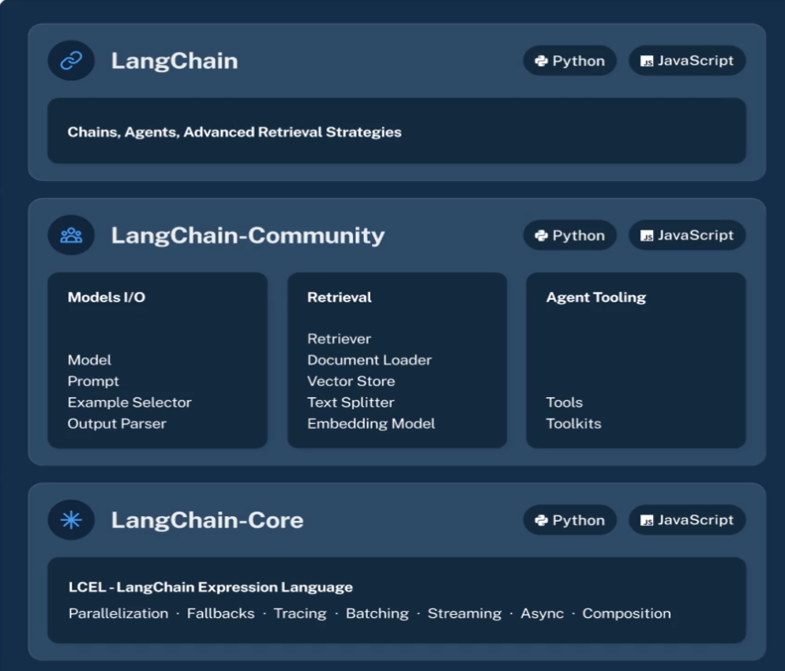

# Introduction to the LangChain Framework

LangChain is a framework designed to simplify the creation of applications powered by LLMs. It acts as a bridge between 
you and the model, helping build apps without needing intricate knowledge of how LLMs work internally.

**Note:** It's worth learning the base functions of the various APIs, so you can effectively troubleshoot and also 
understand what the framework is actually doing behind the scenes.

Conversational memory (notes are specifically within the context of conversational memory using RAG) is a function of 
a framework but not the LLM. Similar to memory related to program or code generation. Need more info and need to expand 
my understanding of this and check the assumptions.

## LangChain Benefits
* Can connect LLMs to data sources
  * DBs
  * Excel
  * Documents
  * etc
* Chain operations
* Customization
* Easy Setup
* Faster development of LLM Apps
* Reduced Complexity
* Open-source

## Limitations
* Emerging Technology - delay between availability and support. Fast moving support and churn to support new capabilities.
  * May have some temporary compatibility issues as new features emerge.
* Flexibility Trade-off - Limited to use cases supported/prioritized by the framework. The simplification and
encapsulation can limit what can be done versus working directly with the LLM APIs.
  * LangChain can be extended so, this isn't a hard limitation. Same applies to the first bulleted limitation as well.

## LangChain Components
* Chains - sequence of operations
* Agents - expert systems focused on a domain. Used to perform complex tasks. Network of interacting agents. Can make
intelligent decisions about next actions - including tools or other agents.
* Advanced Retrieval Strategies

## LangChain Key Concepts
* Chains consist of multiple components able to create advanced use cases. Components include:
  * Prompt Templates
  * LLMs - can invoke multiple LLMs - multi-modal
  * Agents - expert systems for specific tasks: web search, calculations, code, etc that are looped into the operations logic.
  * Memory - Short term, long term memory